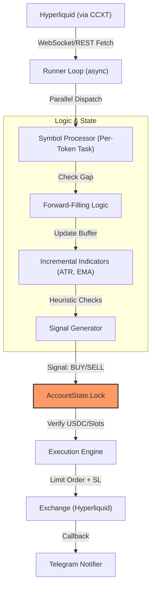

# System Architecture: LiquidBananas

This document visualizes the high-concurrency execution environment and state management logic.

## Data Flow: From Tick to Trade

The following diagram illustrates the lifecycle of a market price tick through our asynchronous stack.

## Core Engineering Pillars

### 1. Asynchronous Concurrency
To manage ~50 tokens simultaneously, we moved from synchronous Flask to **Quart/Asyncio**. This allows the bot to wait for exchange network IO (fetching bars) without stalling the internal logic of other tokens.

### 2. The State Lock (`asyncio.Lock`)
State synchronization is the #1 failure point in trading bots. Our `AccountState` uses a mutex lock to ensure that:
1.  We don't over-commit USDC to multiple simultaneous signals.
2.  Position reconciliation doesn't happen while an order is "in flight."

### 3. Fault Tolerance: The Reconciliation Loop
On startup or after a crash, the bot executes `reconcile_state()`. This queries the exchange directly for:
*   Realized USDC balance.
*   Open Positions.
*   Active Limit Orders.
It then rebuilds the local state before the first tick, preventing "double entries" or lost stop-losses.
